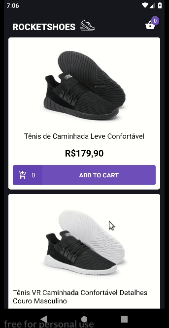

<h1 align="center">
	bootcamp-gostack-desafio07
</h1>

<h3 align="center">
  Challenge 7: React Native - Redux
</h3>

<p align="center">
  
</p>

A simple React Native application that creates an e-commerce interface.
The app uses the Flux Architecture.

#### Application screen



## Technologies

- [NodeJS 10.16.3](https://nodejs.org/)
- [ReactJS 16.9.0](https://reactjs.org/)
- [React Native 0.60.5](https://facebook.github.io/react-native/)
- [JSON Server 0.15.1](https://github.com/typicode/json-server)

## Run

```bash
# After clone the project
$ cd bootcamp-gostack-desafio06

# Install packages
$ yarn install
# or
$ npm install

# Run the app -> you need an Android device or emulador installed
$ react-native start
# you will need two new terminals
# one
# change XXX to your corresponding local IP (you may have to change the app baseURL on /src/services/api.js)
$ json-server --host 192.168.1.XXX server.json -p 3333
# two
$ react-native run-android

```

_Note.: this app has not been tested on iOS device_

---

This is part of my [GoStack](https://rocketseat.com.br/bootcamp) training
